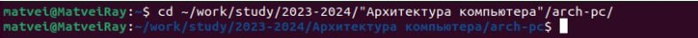
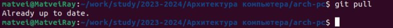
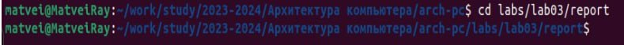
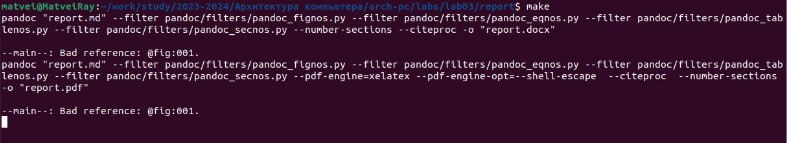
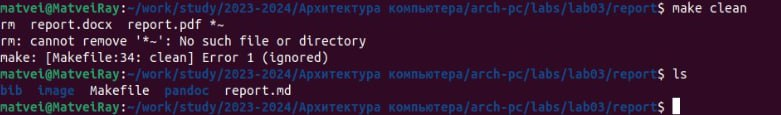
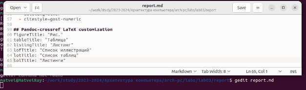

---
## Front matter
title: "Отчет по лабораторной работы №3"
subtitle: "Архитектура компьютеров и Операционные системы"
author: "Матвей Витальевич Райко"

## Generic otions
lang: ru-RU
toc-title: "Содержание"

## Bibliography
bibliography: bib/cite.bib
csl: pandoc/csl/gost-r-7-0-5-2008-numeric.csl

## Pdf output format
toc: true # Table of contents
toc-depth: 2
lof: true # List of figures
lot: true # List of tables
fontsize: 12pt
linestretch: 1.5
papersize: a4
documentclass: scrreprt

## I18n polyglossia
polyglossia-lang:
  name: russian
  options:
	- spelling=modern
	- babelshorthands=true
polyglossia-otherlangs:
  name: english
  
## I18n babel
babel-lang: russian
babel-otherlangs: english

## Fonts
mainfont: DejaVuSerif
romanfont: Times New Roman
sansfont: DejaVu Sans
monofont: DejaVuSansMono
mainfontoptions: Ligatures=TeX
romanfontoptions: Ligatures=TeX
sansfontoptions: Ligatures=TeX,Scale=MatchLowercase
monofontoptions: Scale=MatchLowercase,Scale=0.9

## Biblatex
biblatex: true
biblio-style: "gost-numeric"
biblatexoptions:
  - parentracker=true
  - backend=biber
  - hyperref=auto
  - language=auto
  - autolang=other*
  - citestyle=gost-numeric
  
## Pandoc-crossref LaTeX customization
figureTitle: "Рис."
tableTitle: "Таблица"
listingTitle: "Листинг"
lofTitle: "Список иллюстраций"
lotTitle: "Список таблиц"
lolTitle: "Листинги"

## Misc options
indent: true
header-includes:
  - \usepackage{indentfirst}
  - \usepackage{float} # keep figures where there are in the text
  - \floatplacement{figure}{H} # keep figures where there are in the text
---

# Цель работы

Целью работы является освоение процедуры оформления отчетов с помощью легковесного
языка разметки Markdown.

# Задание

1. Установка нужного технического обеспечения 

2. Выполнение лабораторной работы с помощью языка разметки Markdown 

# Теоретическое введение

Язык разметки Markdown предоставляет простой и удобный способ форматирования текста. Для создания заголовков используется символ '#', а для выделения текста полужирным - двойные звездочки. Курсив обозначается одинарными звездочками, а полужирный и курсивный текст - тройными звездочками. 

Блоки цитирования создаются с использованием символа '>'. Упорядоченные списки форматируются с помощью цифр, а неупорядоченные - звездочек или тире. Вложенные списки добавляются с отступом для элементов дочернего списка. 

Ссылки в Markdown могут быть встроенными или с использованием ограниченных блоков кода. Для вставки изображений используется синтаксис с подписью и необязательной подсказкой. 

Для формул применяется синтаксис LaTeX, как внутритекстовых, так и выключенных формул. Процесс преобразования файлов в формат Markdown в файлы в форматах docx или pdf можно осуществить с помощью инструмента pandoc и соответствующего Makefile.

# Выполнение лабораторной работы

1. Откройте терминал
2. Перейдите в каталог курса сформированный при выполнении лабораторной работы
№2:
cd ~/work/study/2023-2024/"Архитектура компьютера"/arch-pc/

 

Обновите локальный репозиторий, скачав изменения из удаленного репозитория с помощью команды
git pull

 

3. Перейдите в каталог с шаблоном отчета по лабораторной работе № 3
cd ~/work/study/2023-2024/"Архитектура компьютера"/arch-pc/labs/lab03/report

 

4. Проведите компиляцию шаблона с использованием Makefile. Для этого введите команду
make

 

5. Удалите полученный файлы с использованием Makefile. Для этого введите команду
make clean
Проверьте, что после этой команды файлы report.pdf и report.docx были удалены.

 

6. Откройте файл report.md c помощью любого текстового редактора, например gedit
gedit report.md
Внимательно изучите структуру этого файла.

 

# Выводы

Научился работать с Pandoc и TeX live.Понял как работает язык разметки Markdown.

# Список литературы{.unnumbered}

1. GDB: The GNU Project Debugger. — URL: https://www.gnu.org/software/gdb/.
2. GNU Bash Manual. — 2016. — URL: https://www.gnu.org/software/bash/manual/.
3. Midnight Commander Development Center. — 2021. — URL: https://midnight-commander.
org/.
4. NASM Assembly Language Tutorials. — 2021. — URL: https://asmtutor.com/.
5. Newham C. Learning the bash Shell: Unix Shell Programming. — O’Reilly Media, 2005. —
354 с. — (In a Nutshell). — ISBN 0596009658. — URL: http://www.amazon.com/Learningbash-Shell-Programming-Nutshell/dp/0596009658.
6. Robbins A. Bash Pocket Reference. — O’Reilly Media, 2016. — 156 с. — ISBN 978-1491941591.
7. The NASM documentation. — 2021. — URL: https://www.nasm.us/docs.php.
8. Zarrelli G. Mastering Bash. — Packt Publishing, 2017. — 502 с. — ISBN 9781784396879.
9. Колдаев В. Д., Лупин С. А. Архитектура ЭВМ. — М. : Форум, 2018.
10. Куляс О. Л., Никитин К. А. Курс программирования на ASSEMBLER. — М. : Солон-Пресс,
2017.
11. Новожилов О. П. Архитектура ЭВМ и систем. — М. : Юрайт, 2016.
12. Расширенный ассемблер: NASM. — 2021. — URL: https://www.opennet.ru/docs/RUS/nasm/.
13. Робачевский А., Немнюгин С., Стесик О. Операционная система UNIX. — 2-е изд. — БХВПетербург, 2010. — 656 с. — ISBN 978-5-94157-538-1.
14. Столяров А. Программирование на языке ассемблера NASM для ОС Unix. — 2-е изд. —
М. : МАКС Пресс, 2011. — URL: http://www.stolyarov.info/books/asm_unix.
15. Таненбаум Э. Архитектура компьютера. — 6-е изд. — СПб. : Питер, 2013. — 874 с. —
(Классика Computer Science).
16. Таненбаум Э., Бос Х. Современные операционные системы. — 4-е изд. — СПб. : Питер,
2015. — 1120 с. — (Классика Computer Science).

