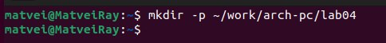

---
## Front matter
title: "Отчет по лабораторной работе №4"
subtitle: "Архитектура компьютеров и Операционные системы"
author: "Райко Матвей Витальевич"

## Generic otions
lang: ru-RU
toc-title: "Содержание"

## Bibliography
bibliography: bib/cite.bib
csl: pandoc/csl/gost-r-7-0-5-2008-numeric.csl

## Pdf output format
toc: true # Table of contents
toc-depth: 2
lof: true # List of figures
lot: true # List of tables
fontsize: 12pt
linestretch: 1.5
papersize: a4
documentclass: scrreprt
## I18n polyglossia
polyglossia-lang:
  name: russian
  options:
	- spelling=modern
	- babelshorthands=true
polyglossia-otherlangs:
  name: english
## I18n babel
babel-lang: russian
babel-otherlangs: english
## Fonts
mainfont: PT Serif
romanfont: PT Serif
sansfont: PT Sans
monofont: PT Mono
mainfontoptions: Ligatures=TeX
romanfontoptions: Ligatures=TeX
sansfontoptions: Ligatures=TeX,Scale=MatchLowercase
monofontoptions: Scale=MatchLowercase,Scale=0.9
## Biblatex
biblatex: true
biblio-style: "gost-numeric"
biblatexoptions:
  - parentracker=true
  - backend=biber
  - hyperref=auto
  - language=auto
  - autolang=other*
  - citestyle=gost-numeric
## Pandoc-crossref LaTeX customization
figureTitle: "Рис."
tableTitle: "Таблица"
listingTitle: "Листинг"
lofTitle: "Список иллюстраций"
lotTitle: "Список таблиц"
lolTitle: "Листинги"
## Misc options
indent: true
header-includes:
  - \usepackage{indentfirst}
  - \usepackage{float} # keep figures where there are in the text
  - \floatplacement{figure}{H} # keep figures where there are in the text
---

# Цель работы

Освоение процедуры компиляции и сборки программ, написанных на ассемблере NASM.

# Задание

1.Программа Hello world! 
2.Транслятор NASM 
3.Расширенный синтаксис командной строки NASM 
4.Компоновщик LD 
5.Запуск исполняемого файла 
6.Задание для самостоятельной работы

# Теоретическое введение

     ЭВМ состоит из центрального процессора (ЦП), памяти и периферийных устройств, связанных общей шиной. ЦП включает арифметико-логическое устройство (выполняет операции), устройство управления (контролирует устройства) и регистры (хранят данные). В программировании на ассемблере регистры используются для операций с данными, таких как перемещение и арифметика.  

     ЭВМ включает периферийные устройства для хранения данных (например, жёсткие диски) и устройства ввода-вывода для взаимодействия с внешней средой. Программное управление осуществляется машинными командами, состоящими из операционной и адресной частей. Команды выполняются в командном цикле процессора, включающем формирование адреса, считывание, дешифрацию, выполнение и переход к следующей команде. 

     Язык ассемблера (asm): это машинно-ориентированный язык низкого уровня, близкий к архитектуре ЭВМ. В отличие от языков высокого уровня, ассемблер позволяет более полный контроль над аппаратными ресурсами. Программы на ассемблере состоят из команд, понятных процессору, записанных с использованием мнемоник. Ассемблерные программы транслируются в машинный код транслятором (ассемблером), обеспечивая высокую производительность. На языке ассемблера программисты указывают инструкции, которые прямо соответствуют операциям процессора, сохраняя контроль над ресурсами. 

Создание ассемблерной программы: 

Написание и сохранение: Программист пишет код на ассемблере и сохраняет в файл (.asm). 

Трансляция: Транслятор (например, nasm) преобразует текст программы в машинный код, создавая объектный файл (. o) и листинг (.lst). 

Компоновка: Компоновщик (ld) обрабатывает объектные файлы, создавая исполняемый файл без расширения, возможно, с картой загрузки (.map). 

Запуск программы: Исполняемый файл запускается. Ошибки требуют отладки с использованием отладчика, после чего цикл повторяется.

# Выполнение лабораторной работы

1 Программа Hello world!:  

Создайте каталог для работы с программами на языке ассемблера NASM:

Перейдите в созданный каталог:

Создайте текстовый файл с именем hello.asm:

Откройте этот файл с помощью любого текстового редактора, например, gedit:

и введите в него следующий текст:

2 Транслятор NASM:

Для компиляции приведённого выше текста программы «Hello World» необходимо написать:

С помощью команды ls проверьте, что объектный файл был создан:

3 Расширенный синтаксис командной строки NASM:

Выполните следующую команду  

(данная команда скомпилирует исходный файл hello.asm в obj.o (опция -o позволяет задать имя объектного файла, в данном случае obj.o), при этом формат выходного файла будет elf, и в него будут включены символы для отладки (опция -g), кроме того, будет создан файл листинга list.lst (опция -l).) :

4 Компоновщик LD:

Чтобы получить исполняемую программу, объектный файл необходимо передать на обработку компоновщику:

С помощью команды ls проверьте, что исполняемый файл hello был создан:

Выполните следующую команду:

5 Запуск исполняемого файла:

Запустить на выполнение созданный исполняемый файл, находящийся в текущем каталоге, можно, набрав в командной строке:

6 Задание для самостоятельной работы:

1. В каталоге ~/work/arch-pc/lab04 с помощью команды cp создайте копию файла hello.asm с именем lab4.asm

2. С помощью любого текстового редактора внесите изменения в текст программы в файле lab4.asm так, чтобы вместо Hello world! на экран выводилась строка с вашими фамилией и именем.

3. Оттранслируйте полученный текст программы lab4.asm в объектный файл. Выполните компоновку объектного файла и запустите получившийся исполняемый файл.

4. Скопируйте файлы hello.asm и lab4.asm в Ваш локальный репозиторий в каталог ~/work/study/2023-2024/"Архитектура компьютера"/arch-pc/labs/lab04/. Загрузите файлы на Github:

# Выводы

Освоение ассемблера способствует развитию навыков оптимизации кода, что приводит к повышению производительности программ. Кроме того, данное изучение открывает путь к освоению более высокоуровневых языков программирования, предоставляя более высокий уровень абстракции и удобства при написании кода. Приобретенные знания по языку ассемблера также облегчают изучение работы компилятора и понимание того, какие инструкции выполняются на более низком уровне.

# Список литературы{.unnumbered}

1. GDB: The GNU Project Debugger. — URL: https://www.gnu.org/software/gdb/.
2. GNU Bash Manual. — 2016. — URL: https://www.gnu.org/software/bash/manual/.
3. Midnight Commander Development Center. — 2021. — URL: https://midnight-commander.
org/.
4. NASM Assembly Language Tutorials. — 2021. — URL: https://asmtutor.com/.
5. Newham C. Learning the bash Shell: Unix Shell Programming. — O’Reilly Media, 2005. —
354 с. — (In a Nutshell). — ISBN 0596009658. — URL: http://www.amazon.com/Learningbash-Shell-Programming-Nutshell/dp/0596009658.
6. Robbins A. Bash Pocket Reference. — O’Reilly Media, 2016. — 156 с. — ISBN 978-1491941591.
7. The NASM documentation. — 2021. — URL: https://www.nasm.us/docs.php.
8. Zarrelli G. Mastering Bash. — Packt Publishing, 2017. — 502 с. — ISBN 9781784396879.
9. Колдаев В. Д., Лупин С. А. Архитектура ЭВМ. — М. : Форум, 2018.
10. Куляс О. Л., Никитин К. А. Курс программирования на ASSEMBLER. — М. : Солон-Пресс,
2017.
11. Новожилов О. П. Архитектура ЭВМ и систем. — М. : Юрайт, 2016.
12. Расширенный ассемблер: NASM. — 2021. — URL: https://www.opennet.ru/docs/RUS/nasm/.
13. Робачевский А., Немнюгин С., Стесик О. Операционная система UNIX. — 2-е изд. — БХВПетербург, 2010. — 656 с. — ISBN 978-5-94157-538-1.
14. Столяров А. Программирование на языке ассемблера NASM для ОС Unix. — 2-е изд. —
М. : МАКС Пресс, 2011. — URL: http://www.stolyarov.info/books/asm_unix.
15. Таненбаум Э. Архитектура компьютера. — 6-е изд. — СПб. : Питер, 2013. — 874 с. —
(Классика Computer Science).
16. Таненбаум Э., Бос Х. Современные операционные системы. — 4-е изд. — СПб. : Питер,
2015. — 1120 с. — (Классика Computer Science).

