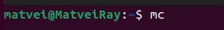

---
## Front matter
title: "Шаблон отчёта по лабораторной работе"
subtitle: "Простейший вариант"
author: "Дмитрий Сергеевич Кулябов"

## Generic otions
lang: ru-RU
toc-title: "Содержание"

## Bibliography
bibliography: bib/cite.bib
csl: pandoc/csl/gost-r-7-0-5-2008-numeric.csl

## Pdf output format
toc: true # Table of contents
toc-depth: 2
lof: true # List of figures
lot: true # List of tables
fontsize: 12pt
linestretch: 1.5
papersize: a4
documentclass: scrreprt
## I18n polyglossia
polyglossia-lang:
  name: russian
  options:
	- spelling=modern
	- babelshorthands=true
polyglossia-otherlangs:
  name: english
## I18n babel
babel-lang: russian
babel-otherlangs: english
## Fonts
mainfont: PT Serif
romanfont: PT Serif
sansfont: PT Sans
monofont: PT Mono
mainfontoptions: Ligatures=TeX
romanfontoptions: Ligatures=TeX
sansfontoptions: Ligatures=TeX,Scale=MatchLowercase
monofontoptions: Scale=MatchLowercase,Scale=0.9
## Biblatex
biblatex: true
biblio-style: "gost-numeric"
biblatexoptions:
  - parentracker=true
  - backend=biber
  - hyperref=auto
  - language=auto
  - autolang=other*
  - citestyle=gost-numeric
## Pandoc-crossref LaTeX customization
figureTitle: "Рис."
tableTitle: "Таблица"
listingTitle: "Листинг"
lofTitle: "Список иллюстраций"
lotTitle: "Список таблиц"
lolTitle: "Листинги"
## Misc options
indent: true
header-includes:
  - \usepackage{indentfirst}
  - \usepackage{float} # keep figures where there are in the text
  - \floatplacement{figure}{H} # keep figures where there are in the text
---

# Цель работы

Приобретение практических навыков работы в Midnight Commander. Освоение инструкций языка ассемблера mov и int.

# Задание

4.1 Работа c Midnight Commander 

4.2 Подключение внешнего файла in_out.asm 

4.3 Задание для самостоятельной работы

# Теоретическое введение

Midnight Commander (или просто mc) — это программа, которая позволяет просматривать структуру каталогов и выполнять основные операции по управлению файловой системой, т.е. mc является файловым менеджером. Midnight Commander позволяет сделать работу с файлами более удобной и наглядной. Для активации оболочки Midnight Commander достаточно ввести в командной строке mc и нажать клавишу Enter (рис. 5.1). В Midnight Commander используются функциональные клавиши F1 — F10 , к которым привязаны часто выполняемые операции. 

Программа на языке ассемблера NASM, как правило, состоит из трёх секций: секция кода программы (SECTION .text), секция инициированных (известных во время компиляции) данных (SECTION .data) и секция неинициализированных данных (тех, под которые во время компиляции только отводится память, а значение присваивается в ходе выполнения программы) (SECTION .bss).

# Выполнение лабораторной работы

4.1. Работа c Midnight Commander:

1 Откройте Midnight Commander:

2 Пользуясь клавишами ↑ , ↓ и Enter перейдите в каталог ~/work/arch-pc созданный при выполнении лабораторной работы №4:

3 С помощью функциональной клавиши F7 создайте папку lab05 и перейдите в созданный каталог:

4 Пользуясь строкой ввода и командой touch создайте файл lab5-1.asm:

5 С помощью функциональной клавиши F4 откройте файл lab5-1.asm для редактирования во встроенном редакторе. Как правило в качестве встроенного редактора Midnight Commander используется редакторы nano или mcedit:

6 Введите текст программы из листинга 5.1 (можно без комментариев), сохраните изменения и закройте файл:

7 С помощью функциональной клавиши F3 откройте файл lab5-1.asm для просмотра. Убедитесь, что файл содержит текст программы:

8 Оттранслируйте текст программы lab5-1.asm в объектный файл. Выполните компоновку объектного файла и запустите получившийся исполняемый файл. Программа выводит строку 'Введите строку:' и ожидает ввода с клавиатуры. На запрос введите Ваши ФИО:

4.2 Подключение внешнего файла in_out.asm:

9 Скачайте файл in_out.asm со страницы курса в ТУИС:

10 Подключаемый файл in_out.asm должен лежать в том же каталоге, что и файл с программой, в которой он используется:

11 С помощью функциональной клавиши F6 создайте копию файла lab5-1.asm с именем lab5-2.asm. Выделите файл lab5-1.asm, нажмите клавишу F6 , введите имя файла lab5-2.asm и нажмите клавишу Enter:

12 Исправьте текст программы в файле lab5-2.asm с использование подпрограмм из внешнего файла in_out.asm (используйте подпрограммы sprintLF, sread и quit) в соответствии с листингом 5.2. Создайте исполняемый файл и проверьте его работу:

13 В файле lab5-2.asm замените подпрограмму sprintLF на sprint. Создайте исполняемый файл и проверьте его работу. В чем разница?

sprint – вывод сообщения на экран, перед вызовом sprint в регистр eax необходимо записать выводимое сообщение (mov eax, message),а 
sprintLF также работает, но при выводе на экран добавляет к сообщению символ перевода строки.

4.3 Задание для самостоятельной работы:

1 Создайте копию файла lab5-1.asm. Внесите изменения в программу (без использования внешнего файла in_out.asm), так чтобы она работала по следующему алгоритму:  

• вывести приглашение типа “Введите строку:”; 

• ввести строку с клавиатуры; 

• вывести введённую строку на экран.

2 Получите исполняемый файл и проверьте его работу. На приглашение ввести строку введите свою фамилию:

3 Создайте копию файла lab5-2.asm. Исправьте текст программы с использование подпрограмм из внешнего файла in_out.asm, так чтобы она работала по следующему алгоритму:  

• вывести приглашение типа “Введите строку:”;  

• ввести строку с клавиатуры;  

• вывести введённую строку на экран.

4 Создайте исполняемый файл и проверьте его работу:

# Выводы

Изучив Midnight Commander, я осознал, что это мощный инструмент для управления файлами в командной строке. Его удобный интерфейс и эффективные команды позволяют мне легко копировать, перемещать и удалять файлы. Функции архивации, быстрого доступа и встроенные редакторы упрощают работу с содержимым файлов. Изучение Midnight Commander значительно улучшило мой опыт работы с файлами в командной строке, делая процесс более эффективным и удобным.

# Список литературы{.unnumbered}

1. GDB: The GNU Project Debugger. — URL: https://www.gnu.org/software/gdb/.
2. GNU Bash Manual. — 2016. — URL: https://www.gnu.org/software/bash/manual/.
3. Midnight Commander Development Center. — 2021. — URL: https://midnight-commander.
org/.
4. NASM Assembly Language Tutorials. — 2021. — URL: https://asmtutor.com/.
5. Newham C. Learning the bash Shell: Unix Shell Programming. — O’Reilly Media, 2005. —
354 с. — (In a Nutshell). — ISBN 0596009658. — URL: http://www.amazon.com/Learningbash-Shell-Programming-Nutshell/dp/0596009658.
6. Robbins A. Bash Pocket Reference. — O’Reilly Media, 2016. — 156 с. — ISBN 978-1491941591.
7. The NASM documentation. — 2021. — URL: https://www.nasm.us/docs.php.
8. Zarrelli G. Mastering Bash. — Packt Publishing, 2017. — 502 с. — ISBN 9781784396879.
9. Колдаев В. Д., Лупин С. А. Архитектура ЭВМ. — М. : Форум, 2018.
10. Куляс О. Л., Никитин К. А. Курс программирования на ASSEMBLER. — М. : Солон-Пресс,
2017.
11. Новожилов О. П. Архитектура ЭВМ и систем. — М. : Юрайт, 2016.
12. Расширенный ассемблер: NASM. — 2021. — URL: https://www.opennet.ru/docs/RUS/nasm/.
13. Робачевский А., Немнюгин С., Стесик О. Операционная система UNIX. — 2-е изд. — БХВПетербург, 2010. — 656 с. — ISBN 978-5-94157-538-1.
14. Столяров А. Программирование на языке ассемблера NASM для ОС Unix. — 2-е изд. —
М. : МАКС Пресс, 2011. — URL: http://www.stolyarov.info/books/asm_unix.
15. Таненбаум Э. Архитектура компьютера. — 6-е изд. — СПб. : Питер, 2013. — 874 с. —
(Классика Computer Science).
16. Таненбаум Э., Бос Х. Современные операционные системы. — 4-е изд. — СПб. : Питер,
2015. — 1120 с. — (Классика Computer Science).

