---
## Front matter
title: "Отчет по лабораторной работе №4"
subtitle: "Архитектура компьютеров и Операционные системы"
author: "Матвей Витальевич Райко"

## Generic otions
lang: ru-RU
toc-title: "Содержание"

## Bibliography
bibliography: bib/cite.bib
csl: pandoc/csl/gost-r-7-0-5-2008-numeric.csl

## Pdf output format
toc: true # Table of contents
toc-depth: 2
lof: true # List of figures
lot: true # List of tables
fontsize: 12pt
linestretch: 1.5
papersize: a4
documentclass: scrreprt
## I18n polyglossia
polyglossia-lang:
  name: russian
  options:
	- spelling=modern
	- babelshorthands=true
polyglossia-otherlangs:
  name: english
## I18n babel
babel-lang: russian
babel-otherlangs: english
## Fonts
mainfont: PT Serif
romanfont: PT Serif
sansfont: PT Sans
monofont: PT Mono
mainfontoptions: Ligatures=TeX
romanfontoptions: Ligatures=TeX
sansfontoptions: Ligatures=TeX,Scale=MatchLowercase
monofontoptions: Scale=MatchLowercase,Scale=0.9
## Biblatex
biblatex: true
biblio-style: "gost-numeric"
biblatexoptions:
  - parentracker=true
  - backend=biber
  - hyperref=auto
  - language=auto
  - autolang=other*
  - citestyle=gost-numeric
## Pandoc-crossref LaTeX customization
figureTitle: "Рис."
tableTitle: "Таблица"
listingTitle: "Листинг"
lofTitle: "Список иллюстраций"
lotTitle: "Список таблиц"
lolTitle: "Листинги"
## Misc options
indent: true
header-includes:
  - \usepackage{indentfirst}
  - \usepackage{float} # keep figures where there are in the text
  - \floatplacement{figure}{H} # keep figures where there are in the text
---

# Цель работы

Освоение арифметических инструкций языка ассемблера NASM

# Задание

4.1 Символьные и численные данные в NASM
4.2 Выполнение арифметических операций в NASM
4.3 Задание для самостоятельной работы

# Теоретическое введение

В ассемблере существуют три основных способа адресации:
Регистровая адресация:
Операнды хранятся в регистрах, используются их имена в командах (например, mov ax, bx).
Непосредственная адресация:
Значение операнда указывается непосредственно в команде (например, mov ax, 2).
Адресация памяти:
Операнд задает адрес в памяти, используется символическое обозначение ячейки памяти в команде (например, mov eax, [intg] копирует данные из памяти в регистр).

В файле in_out.asm для работы с вводом и выводом информации в символьном виде с использованием кодировки ASCII представлены следующие подпрограммы:
iprint:
Отвечает за вывод чисел в формате ASCII.
Перед вызовом iprint в регистр eax необходимо записать число (mov eax, <int>).

iprintLF:
Работает аналогично iprint, но при выводе на экран после числа добавляет символ перевода строки.

atoi:
Функция преобразует ASCII-код символа в целое число и записывает результат в регистр eax.
Перед вызовом atoi в регистр eax необходимо записать ASCII-код символа (mov eax, <ascii_code>).

Эти подпрограммы обеспечивают корректное преобразование между ASCII-символами и числами, что важно для выполнения арифметических операций и обработки ввода/вывода в ассемблерных программах.

# Выполнение лабораторной работы

4.1. Символьные и численные данные в NASM:
1. Создайте каталог для программам лабораторной работы № 6, перейдите в него и создайте файл lab6-1.asm:
mkdir ~/work/arch-pc/lab06 
cd ~/work/arch-pc/lab06 
touch lab6-1.asm

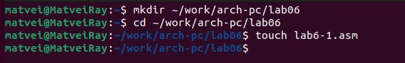

2. Рассмотрим примеры программ вывода символьных и численных значений. Программы будут выводить значения записанные в регистр eax. Введите в файл lab6-1.asm текст программы из листинга 6.1. В данной программе в регистр eax записывается символ 6 (mov eax,'6'), в регистр ebx символ 4 (mov ebx,'4'). Далее к значению в регистре eax прибавляем значение регистра ebx (add eax,ebx, результат сложения запишется в регистр eax). Далее выводим результат. Так как для работы функции sprintLF в регистр eax должен быть записан адрес, необходимо использовать дополнительную переменную. Для этого запишем значение регистра eax в переменную buf1 (mov [buf1],eax), а затем запишем адрес переменной buf1 в регистр eax (mov eax,buf1) и вызовем функцию sprintLF.

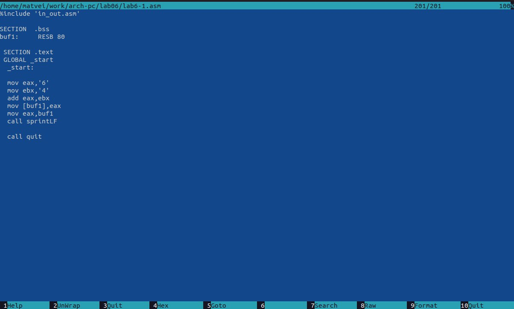

Создайте исполняемый файл и запустите его. 
nasm -f elf lab6-1.asm
 ld -m elf_i386 -o lab6-1 lab6-1.o 
./lab6-1

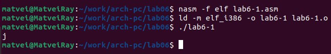

3. Далее изменим текст программы и вместо символов, запишем в регистры числа. Исправьте текст программы (Листинг 6.1) следующим образом: замените строки:
mov eax,'6' mov ebx,'4' на строки mov eax,6 mov ebx,4

Создайте исполняемый файл и запустите его. Как и в предыдущем случае при исполнении программы мы не получим число 10. В данном случае выводится символ с кодом 10. Пользуясь таблицей ASCII определите какому символу соответствует код 10. Отображается ли этот символ при выводе на экран?

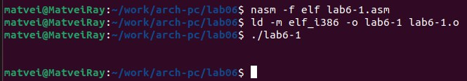

Cимвол не отображается на экране 

4. Как отмечалось выше, для работы с числами в файле in_out.asm реализованы подпрограммы для преобразования ASCII символов в числа и обратно. Преобразуем текст программы из Листинга 6.1 с использованием этих функций.
Создайте файл lab6-2.asm в каталоге ~/work/arch-pc/lab06 и введите в него текст программы из листинга 6.2.

touch ~/work/arch-pc/lab06/lab6-2.asm

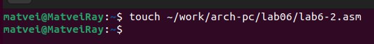

Создайте исполняемый файл и запустите его.
nasm -f elf lab6-2.asm 
ld -m elf_i386 -o lab6-2 lab6-2.o 
./lab6-2

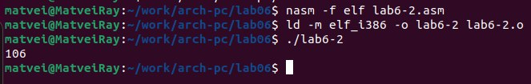

5. Аналогично предыдущему примеру изменим символы на числа. Замените строки mov eax,'6' mov ebx,'4' на строки mov eax,6 mov ebx,4

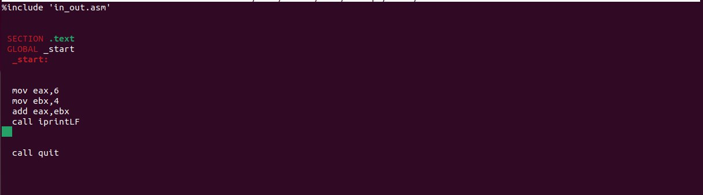

Создайте исполняемый файл и запустите его. Какой результат будет получен при исполнении программы?

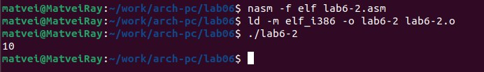

Замените функцию iprintLF на iprint. Создайте исполняемый файл и запустите его. Чем отличается вывод функций iprintLF и iprint?

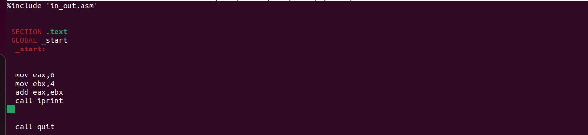

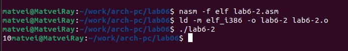

4.2. Выполнение арифметических операций в NASM:

6. В качестве примера выполнения арифметических операций в NASM приведем программу вычисления арифметического выражения 𝑓(𝑥) = (5 ∗ 2 + 3)/3. 
Создайте файл lab6-3.asm в каталоге ~/work/arch-pc/lab06: 
touch ~/work/arch-pc/lab06/lab6-3.asm

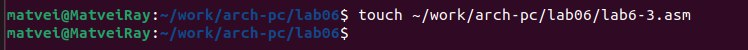

Внимательно изучите текст программы из листинга 6.3 и введите в lab6-3.asm:

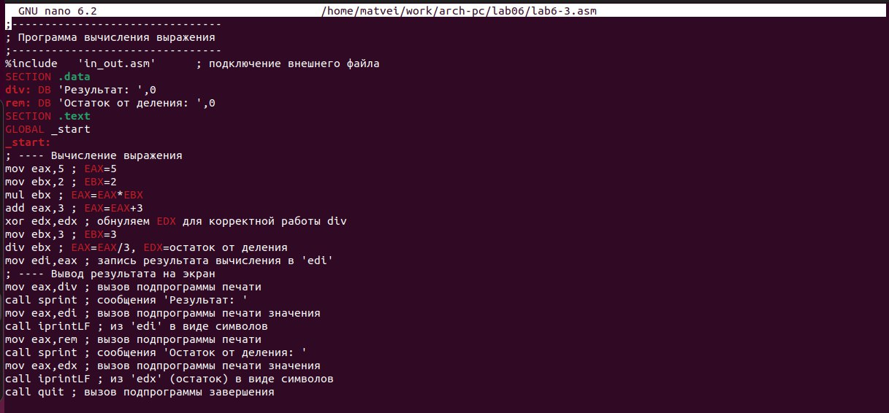

Создайте исполняемый файл и запустите его. Результат работы программы должен быть следующим: 
user@dk4n31:~$ ./lab6-3 
Результат: 4 Остаток от деления: 1 
user@dk4n31:~$

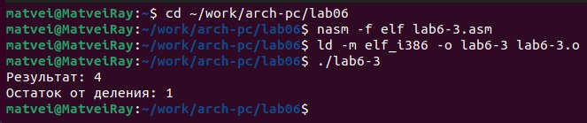

Измените текст программы для вычисления выражения 𝑓(𝑥) = (4 ∗ 6 + 2)/5. Создайте исполняемый файл и проверьте его работу.

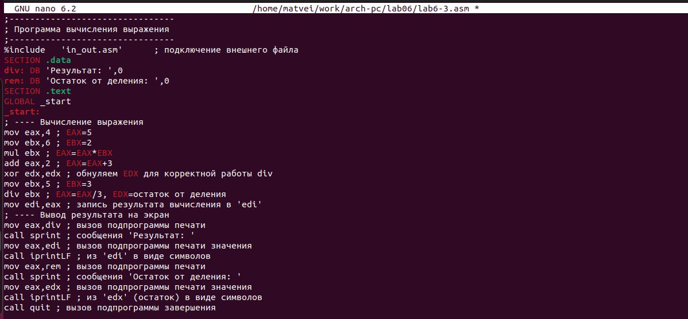

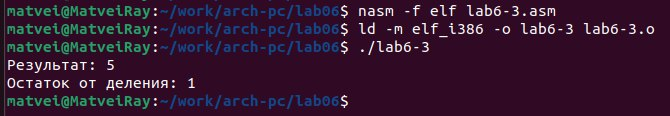

Создайте файл variant.asm в каталоге ~/work/arch-pc/lab06: 
touch ~/work/arch-pc/lab06/variant.asm

Внимательно изучите текст программы из листинга 6.4 и введите в файл variant.asm:

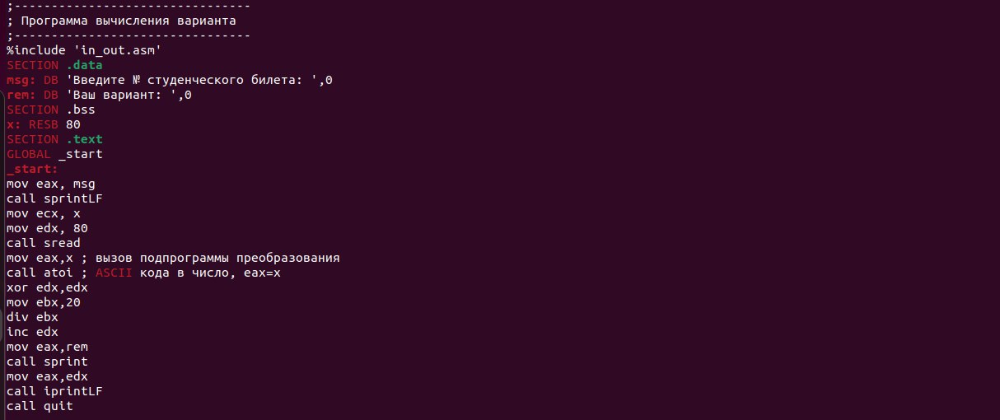

Создайте исполняемый файл и запустите его. Проверьте результат работы программы вычислив номер варианта аналитически

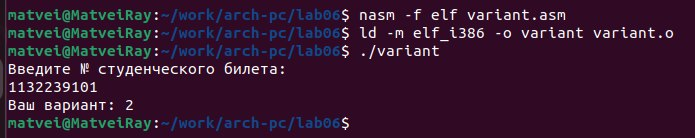

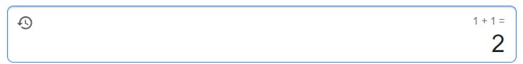

Включите в отчет по выполнению лабораторной работы ответы на следующие вопросы: 
1. Какие строки листинга 6.4 отвечают за вывод на экран
сообщения ‘Ваш вариант:’?
mov eax,rem 
call sprint
2. Для чего используется следующие инструкции? 
mov ecx, x 
mov edx, 80 
call sread

mov ecx, x: Копирует значение переменной x в регистр ecx. 
mov edx, 80: Устанавливает значение 80 в регистр edx. Это параметр, который передается в функцию sread. Это количество байт или размер данных, которые нужно прочитать.
call sread: Вызывает функцию с именем sread. Эта функция,занимается чтением данных, и она может использовать значения, сохраненные в регистрах ecx и edx в своей работе.

3. Для чего используется инструкция “call atoi”?
Инструкция call atoi используются для передачи строки в функцию atoi и получения соответствующего целого числа

4. Какие строки листинга 6.4 отвечают за вычисления варианта?
xor edx,edx 
mov ebx,20

div ebx 
inc edx
5. В какой регистр записывается остаток от деления при выполнении инструкции “div ebx”?
Остаток от деления при выполнении инструкции div ebx записывается edx
6. Для чего используется инструкция “inc edx”?
Инструкция inc edx используется для увеличения значения регистра edx на 1.
7. Какие строки листинга 6.4 отвечают за вывод на экран результата вычислений?
mov eax,edx 
call iprintLF

4.3. Задание для самостоятельной работы:

1. Написать программу вычисления выражения 𝑦 = 𝑓(𝑥). Программа должна выводить выражение для вычисления, выводить запрос на ввод значения 𝑥, вычислять заданное выражение в зависимости от введенного 𝑥, выводить результат вычислений. Вид функции 𝑓(𝑥) выбрать из таблицы 6.3 вариантов заданий в соответствии с номером полученным при выполнении лабораторной работы. Создайте исполняемый файл и проверьте его работу для значений 𝑥1 и 𝑥2 из 6.3.

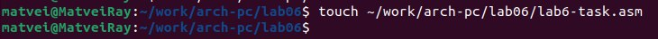

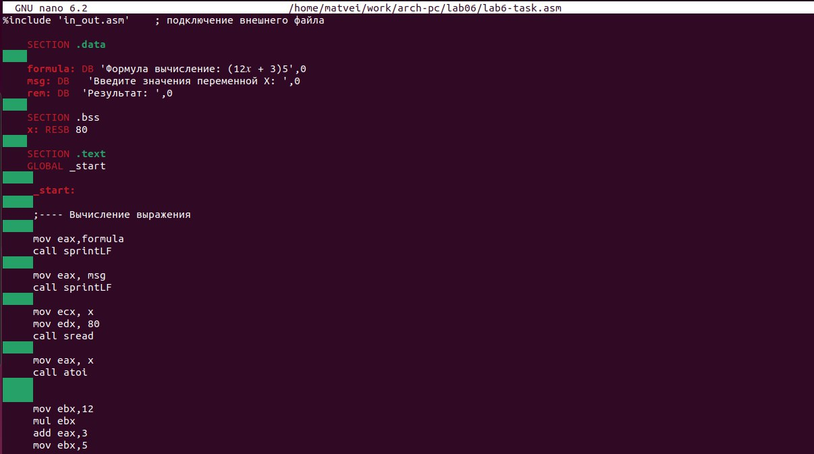

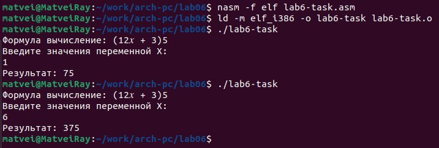

# Выводы

После изучения основ арифметических операций я теперь могу проводить базовые математические операции, такие как сложение, вычитание, умножение и деление, на уровне языка ассемблера. Кроме того, я овладел навыком обращения к различным ячейкам памяти для чтения и записи данных. Мои навыки также включают использование регистров процессора для выполнения операций и хранения промежуточных результатов.

# Список литературы{.unnumbered}

1. GDB: The GNU Project Debugger. — URL: https://www.gnu.org/software/gdb/.
2. GNU Bash Manual. — 2016. — URL: https://www.gnu.org/software/bash/manual/.
3. Midnight Commander Development Center. — 2021. — URL: https://midnight-commander.
org/.
4. NASM Assembly Language Tutorials. — 2021. — URL: https://asmtutor.com/.
5. Newham C. Learning the bash Shell: Unix Shell Programming. — O’Reilly Media, 2005. —
354 с. — (In a Nutshell). — ISBN 0596009658. — URL: http://www.amazon.com/Learningbash-Shell-Programming-Nutshell/dp/0596009658.
6. Robbins A. Bash Pocket Reference. — O’Reilly Media, 2016. — 156 с. — ISBN 978-1491941591.
7. The NASM documentation. — 2021. — URL: https://www.nasm.us/docs.php.
8. Zarrelli G. Mastering Bash. — Packt Publishing, 2017. — 502 с. — ISBN 9781784396879.
9. Колдаев В. Д., Лупин С. А. Архитектура ЭВМ. — М. : Форум, 2018.
10. Куляс О. Л., Никитин К. А. Курс программирования на ASSEMBLER. — М. : Солон-Пресс,
2017.
11. Новожилов О. П. Архитектура ЭВМ и систем. — М. : Юрайт, 2016.
12. Расширенный ассемблер: NASM. — 2021. — URL: https://www.opennet.ru/docs/RUS/nasm/.
13. Робачевский А., Немнюгин С., Стесик О. Операционная система UNIX. — 2-е изд. — БХВПетербург, 2010. — 656 с. — ISBN 978-5-94157-538-1.
14. Столяров А. Программирование на языке ассемблера NASM для ОС Unix. — 2-е изд. —
М. : МАКС Пресс, 2011. — URL: http://www.stolyarov.info/books/asm_unix.
15. Таненбаум Э. Архитектура компьютера. — 6-е изд. — СПб. : Питер, 2013. — 874 с. —
(Классика Computer Science).
16. Таненбаум Э., Бос Х. Современные операционные системы. — 4-е изд. — СПб. : Питер,
2015. — 1120 с. — (Классика Computer Science).

